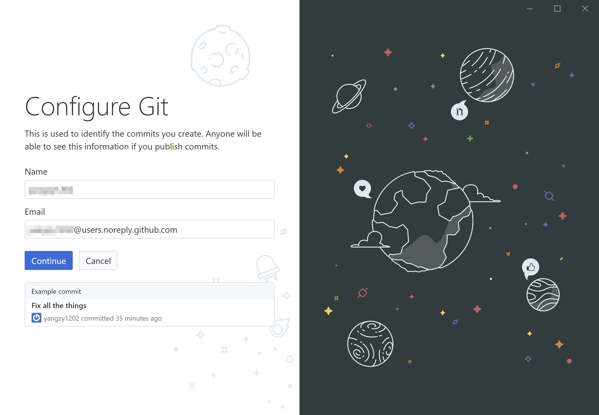
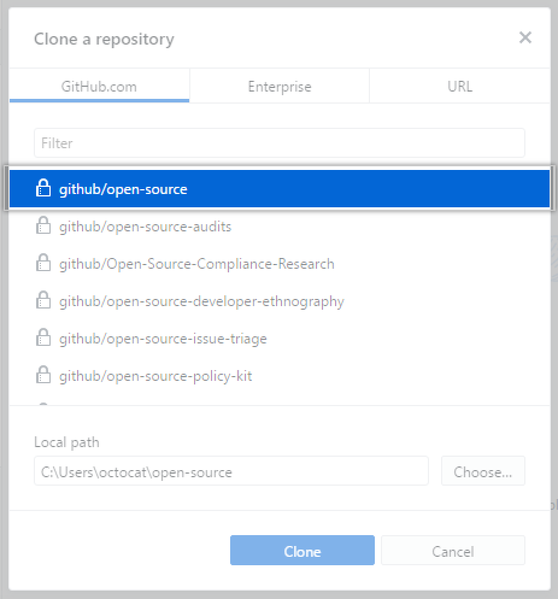
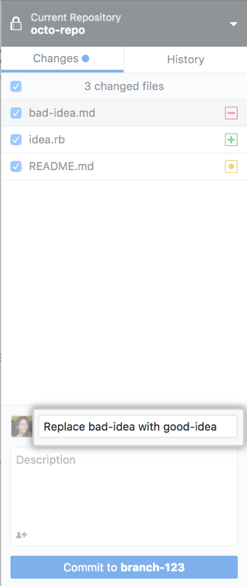
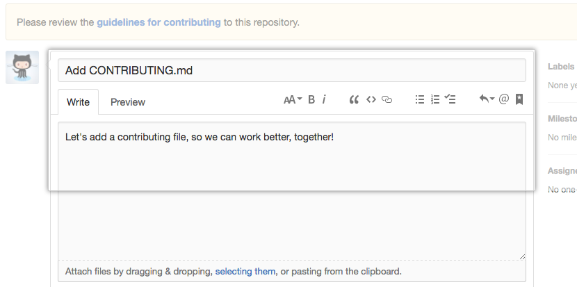

**Learn Git 1 - GitHub 学习笔记**

本学期CCT课程要求大家自行学习Git和GitHub的使用方法，通过使用互联网搜索引擎检索，以及与同学们交流学习经验，我发现目前比较流行的Git教程（如[廖雪峰的官方网站 | Git教程](https://www.liaoxuefeng.com/wiki/896043488029600)、[菜鸟教程 | Git教程](https://www.runoob.com/git/git-tutorial.html )、[Think Like (a) Git](http://think-like-a-git.net/)等）多以使用官方的Git SCM或Git for Windows等在Git SCM基础上改进的第三方工具为基础进行讲解，需要使用命令行来进行创建版本库、修改文本、查看状态等操作，上手难度较大，并不是很适合新手快速入门Git（当然，掌握命令行模式下Git的使用方法还是很有必要的，不仅仅是因为使用命令行能够让你 ”Use Git Like a Pro”，更重要的是只有在命令行模式下你才能执行 Git 的 **所有** 命令，大多数的 GUI 软件只实现了 Git 的部分功能以降低操作难度 ）。

此外，上述教程中的不少内容已经有些过时。比如在最新的Git  2.23.0版本中，丢弃工作区修改的推荐命令已经由` git checkout -- file `改为了 `git restore <file>` ，丢弃工作区中的修改命令也从` git reset HEAD <file> `更改为` git restore --staged <file> `，尽管 Git 在保持向后兼容方面表现很好， 大部分旧命令仍然可以在新版本上使用，但也有少部分旧命令在新版本中不太好用 。因此，直接使用新命令、新方法是更加聪明和高效的方式。

综合考虑上手难度和实用程度，我认为新手可以直接从 GitHub 上手，学习基本的 GitHub Desktop 使用方法之后再深入学习 Git 的命令行用法（实际上使用 GitHub Desktop 即可完成大部分的 Git 操作），这份学习笔记（目前支持Windows和macOS两个平台，Linux 用户只能——话说都用 Linux 的朋友应该也不怎么需要GUI了——嗯……）记录了我学习 Git 的过程和一些小经验，欢迎各位同学交流分享自己的学习和使用经验！

---

[TOC]

---

# GitHub 快速入门

---

## 注册 GitHub 账号

> GitHub是一个面向开源及私有软件项目的托管平台，因为只支持git 作为唯一的版本库格式进行托管，故名GitHub。  GitHub于2008年4月10日正式上线， 如今已成为了程序员（媛）们最大的互动和交流平台😂；2018年6月4日，微软以75亿美元的股票交易收购代码托管平台GitHub。 其官网为： https://github.com/ 。

使用 GitHub Desktop 需要一个 GitHub.com 或 GitHub Enterprise 帐户，注册流程不再赘述，建议大家使用自己比较常用的邮箱地址注册账号，**请注意**在选择你的私人计划 (personal plan)，即选择免费计划还是付费计划，曾经免费用户只能创建开源仓库，但在GitHub 在被 Microsoft 收购后私有仓库已经可以免费使用了！（感谢 Microsoft !🙇‍）

> GitHub 在被 Microsoft 收购后宣布了两个重要更新：一是 GitHub 私有库现在可免费使用，每个免费的存储库最多可以有3人协作，如果想要更多的协作者，则需要付费；二是将 Enterprise Cloud （前身为 GitHub Business Cloud）和 Enterprise Server （前身为 GitHub Enterprise）统一为 GitHub Enterprise ，想要在云或自托管配置中灵活使用 GitHub 的组织现在只需付一个产品的价格就能同时使用这两项服务。 

**Tips**：同学们可以使用北京大学的校园邮箱注册，还可在填写验证信息后获得GitHub Student Developer Pack，里面包含很多实用的开发工具，详情参见 https://education.github.com/pack 

---

## 初识 GitHub Desktop

> GitHub Desktop 官网： https://desktop.github.com/ 


根据自己的操作系统（目前支持Windows和macOS两个平台）安装相应的GitHub Desktop版本，以下操作均基于GitHub Desktop for Windows (64bit)版（请注意GitHub Desktop无法在32位Windows系统下工作，不过这年头要找到一台32位电脑也是真的不容易……），安装完成后需要登录到 GitHub 帐户，之后是“Configure Git（配置 Git）”步骤，用于设置名称和电子邮件地址。为确保提交正确到你的GitHub 帐户上， 这里需要填写GitHub 帐户关联的电子邮件地址（但如果你希望将你的邮箱保密，你可以使用 [GitHub-提供的“no-reply（无需回复）”电子邮件地址](https://help.github.com/articles/about-commit-email-addresses)， 默认为 `@users.noreply.github.com` ）。 



然后，你会看到 GitHub Desktop 的主界面，我们从``**Create a tutorial repository and clone it**. ``开始快速上手我们的第一个Git仓库！


**Tip**：为减少设置开发环境的时间，建议大家安装 Visual Studio Code 并将其作为 GitHub Desktop 的默认文本编辑器，以及将 GitHub Desktop 的默认 Shell 设置为 PowerShell（或 Git Bash，如果你已经安装了Git SCM的话），这些可以在`File`-`Options`-`Advanced`中找到，我们会在后面提到两者的使用。


跟随完成教程的六个步骤后（我相信聪明的你完全可以自己搞定这一切!），你已经初步体验了 `Create a branch` - `Edit a file` - `Make a commit` - `Publish to GitHub` - `Open a pull request` 这一使用GitHub的完整流程，下面我们将学习更多GitHub的使用方法和技巧。

---

## 探索 GitHub Desktop

让我们从建设一个全新的本地`Learn-Git`仓库（Repository）开始来进一步探索 GitHub Desktop！

+ 单击 **Create a New Repository on your Hard Drive...（在硬盘上创建新仓库...）** 


+ 之后我们可以看到一个设置面板，填写好相关字段后，我们单击 **Create repository** 即可创建我们的本地仓库。

  

> **NOTES: **（来自 GitHub 官方帮助文档）
>
> + “Name（名称）” 定义仓库在本地以及 GitHub 上的名称。
> + “Description（说明）” 是一个可选字段，可用于提供有关仓库目的的更多信息。
> + “Local path（本地路径）” 设置仓库在计算机上的位置。
> + **Initialize this repository with a README（使用自述文件初始化此仓库）**创建包含 README.md 文件的初始提交。 自述文件帮助人们了解项目的目的，因此建议选择此选项并加入有用的信息。更多信息请参阅“[关于自述文件](https://help.github.com/articles/about-readmes)” 
> + **Git ignore（Git 忽略）**下拉菜单可让你添加自定义文件，以忽略本地仓库中你不想存储在版本控制中的特定文件。 如有你要使用的特定语言或框架，你可以从可用的列表中选择选项。 如果刚刚开始，尽请跳过此选择。更多信息请参阅“[忽略文件](https://help.github.com/articles/ignoring-files)”。 
> + **License（许可证）**下拉菜单可让你将开源许可证添加到仓库中的 LICENSE 文件。 你无需担心要立即添加许可证。 有关可用开源许可证以及如何将它们添加到仓库的更多信息，请参阅“[许可仓库](https://help.github.com/articles/licensing-a-repository)”。 

接着，让我们来认识一下 “Lean-Git” 仓库的管理界面：

1. 菜单下方的栏显示了 GitHub Desktop 中仓库的当前状态：

- **Current repository（当前仓库）：**目前正在处理的仓库的名称。可以单击 **Current repository（当前仓库）**切换到 GitHub Desktop 中的不同仓库。
- **Current branch（当前分支）：**目前正在处理的分支的名称。 可以单击 **Current branch（当前分支）**来查看仓库中的所有分支、切换到不同的分支或者创建新分支。 在仓库中创建拉取请求后，也可单击 **Current branch（当前分支）**查看它们。
- **Publish repository（发布仓库）：** 目前我们的 “Learn-Git” 仓库只存在于你的计算机中，你是唯一能访问该仓库的人。 将仓库发布到 GitHub 可使其在多个处理同一项目的计算机和团队成员之间保持同步。  


2. 在左侧边栏中，你可以看到 **Changes（更改）**和 **History（历史记录）**视图。

- **Changes（更改）**视图显示你对当前分支中的文件已经做出但尚未提交到本地仓库的更改。 在底部，你还会看到“Summary（摘要）”框和“Description（说明）”文本框，以及 **Commit to master（提交到 master）**按钮。 这是提交新更改的位置。 **Commit（提交）**按钮指示你要将更改提交到哪个分支。


+ **History（历史记录）**视图显示仓库当前分支上以前的提交。 你应会看到在创建仓库时 GitHub Desktop 所创建的“初始提交”。 你可以单击每个文件以查看该文件的差异，也就是提交中对该文件的更改。 差异只显示文件已更改的部分，而不显示文件的全部内容。


3. 将仓库推送到 GitHub，将仓库推送到 GitHub，这样它也会出现在 GitHub.com 上。

+ 单击 **Publish repository（发布仓库）**

  

+ 你会看到 “Name（名称）”和“Description（说明）”与你创建仓库时完成的字段匹配，此外还有一个选项 **Keep this code private（保留此代码为私有）**。如果不想与 GitHub 的其他用户公开分享你的代码，请选择此选项。然后单击 **Publish repository**，即可发布仓库。


+ 我们可以从 GitHub Desktop 访问 GitHub.com 上的仓库。 在文件菜单中，单击 **Repository（仓库）**，然后单击 **View on GitHub（在 GitHub 上查看）**。 这会直接在默认浏览器中打开仓库。


之后，我们就可以对于我们的 `Learn-Git `仓库进行提交和推送更改了，这些我们在 Tutorial 中已经体验过了！

> **Tip:** GitHub Desktop 中的大多数操作也有对应的快捷键，掌握一些常用的快捷键有助于提高工作效率。 
>
> - 关键盘快捷键的完整列表，请参阅“[GitHub Desktop 中的键盘快捷键](https://help.github.com/desktop/getting-started-with-github-desktop/keyboard-shortcuts-in-github-desktop)”。 

---

# GitHub 项目管理

---

## 添加与克隆仓库

我们可以使用 GitHub Desktop 将现有的本地仓库添加到 GitHub，或者将远程的 GitHub 仓库克隆（clone）到本地使用。 

### 将本地 Git 仓库添加到 GitHub Desktop 中

如果你之前已经通过 Git Bash 之类的工具创建了本地的 Git 仓库（目录内应该有一个名为 .git 的隐藏文件夹），你可以将这个本地仓库添加到 GitHub Desktop 以及发布到 GitHub.com。

> **Tip：**可以直接通过拖放文件夹到 GitHub Desktop 的方式，将 Git 仓库从本地计算机添加到 GitHub Desktop。 如果同时将多个 Git 文件夹拖入 GitHub Desktop，则每个文件夹将添加为一个单独的 Git 仓库。 
>
> 

1.  在 **File（文件）**菜单中，单击 **Add Local Repository（添加本地仓库）**。 

   

2.  单击 **Choose...（选择...）**，并使用 Windows 资源管理器找到要添加的本地仓库。 

   

3.  单击 **Add Repository（添加仓库）**。 

   

---

### 使用 GitHub Desktop 添加现有项目到 GitHub

 你可以使用 GitHub Desktop 将现有 Git 仓库添加到 GitHub。 

1. 使用命令行（如 PowerShell 或 Git Bash），删除当前为仓库配置的任何 git 远程分支；然后将仓库添加到 GitHub Desktop（参见前一节）。

```bash
# 显示现有远程分支
$ git remote -v
> origin	git@git-server/octocat/hello-world.git (fetch)
> origin	git@git-server/octocat/hello-world.git (push)
# 删除现有远程分支
$ git remote remove origin
```

2. 单击工具栏上的 **Publish Repository（发布仓库）**按钮。


3. 在 **Name（名称）**字段中键入所需的仓库名称，或者使用默认的当前本地仓库名称。


4. 要发布公共仓库，请取消选择 **Keep this code private（保留此代码为私有）**。


5. 从 **Organization（组织）**下拉菜单中选择要发布仓库到其中的组织，或者选择 **None（无）**以将仓库发布到您的个人帐户。


6. 单击 **Publish Repository（发布仓库）**按钮。


---

### 使用 GitHub Desktop 克隆 GitHub 上的仓库

你可以使用 GitHub Desktop 克隆 GitHub 上的仓库。 

1. 在 **File（文件）**菜单中，单击 **Clone Repository（克隆仓库）**。

   

   

   

2. 单击与要克隆的仓库位置对应的选项卡， 也可以单击 **URL** 手动输入仓库位置。

   

   

   

3. 从列表中选择要克隆的仓库。

   

   

   

4. 单击 **Choose...（选择...）**，并使用 Windows 资源管理器找到要克隆仓库的本地路径。

   

   

5. 单击 **Clone（克隆）**。

   

> **注意**:  GitHub Desktop 不能对仓库复刻（fork），也不能从上游仓库同步到复刻。 您可以[在 GitHub 或 GitHub Enterprise 上对仓库复刻](https://help.github.com/articles/fork-a-repo)并使用 GitHub Desktop 克隆，但需要手动[同步](https://help.github.com/articles/syncing-a-fork)。 

---

### 使用 GitHub 将远程仓库克隆到 GitHub Desktop

你可以使用 GitHub 将远程仓库克隆（clone）到 GitHub Desktop。 

1. 开始克隆前，请先登录到 GitHub 和 GitHub Desktop。

2. 在 GitHub 上，导航到仓库的主页面。

3. 在仓库名称下，单击 **Clone or download（克隆或下载）**。

   

   

4. 单击**Open in Desktop（在 Desktop 中打开）**以克隆仓库并在 GitHub Desktop 中打开。

   

   

5. 单击 **Choose...（选择...）**，并使用 Windows 资源管理器找到要克隆仓库的本地路径。

   

   > **注意：**如果仓库配置为使用 LFS，将会提示您初始化 Git LFS。

   

6. 单击 **Clone（克隆）**。

   

---

## 分支创建与更改

我们可以使用文本编辑器（推荐 Visual Studio Code）对项目进行更爱，然后使用 GitHub Desktop 可视化有用的提交。 

### 创建分支

如果您对仓库具有协作者权限，便可创建仓库默认分支以外的分支，以安全地试验更改。 

> **Tip：**您创建的第一个新分支将基于默认分支，通常是 `master`。 如果有多个分支，您可以选择新分支是以当前检出的分支还是默认分支为基础。 

1. 在应用程序的顶部，通过单击 **当前分支** 并从列表中选择它，切换到要作为新分支基础的分支。

   

   

   

2. 单击 **New Branch（新分支）**。

   

   

   

3. 在 **Name（名称）**下，键入新分支的名称。

   

   

   

4. 选择要作为新分支基础的当前分支或默认分支（通常为 master）。

   

   

   

5. 单击 **Create Branch（创建分支）**。

   

   

---

### 切换分支

您可以查看并提交到任何仓库的分支。 

#### 在分支间切换

如有未提交但已保存的更改，您需要决定如何处理更改，然后才可切换分支。 您可以在当前分支上提交更改、在当前分支上隐藏更改，或者将更改传送到新分支。 如果要在当前分支上提交更改，请在切换分支之前执行“[提交并审查对项目的更改](https://help.github.com/desktop/contributing-to-projects/committing-and-reviewing-changes-to-your-project)”中的步骤。

1. 在应用程序的顶部，单击 **Current Branch（当前分支）**。

   

   

2. 在分支列表中，单击要切换到的分支。

   

   

   

3. 如有已保存但未提交的更改，请选择 **Leave my changes（留下我的更改）**或 **Bring my changes（带上我的更改）**，然后单击 **Switch Branch（切换分支）**。

   

#### 检索隐藏的更改

要访问在另一个分支中隐藏的（Stahed）更改，请切换回隐藏更改的分支。

1. 在应用程序的顶部，单击 **Current Branch（当前分支）**。

   

   

2. 在分支列表中，单击要切换到的分支。

   

   

   

3. 在左侧边栏中，单击 **Stashed Changes（隐藏的更改）**。

   

   

4. 单击 **View stash（查看隐藏）**。

   

   

5. 要删除隐藏的更改，请单击 **Discard（放弃）**，或者，要使用隐藏的更改，则单击 **Restore（恢复）**。

---

### 提交并审查对项目的更改

GitHub Desktop 可在您编辑时跟踪对所有文件的所有更改。 您可以决定如何对更改分组以创建有意义的提交。 

> **提交**类似于保存文件，提交是对分支中一个或多个文件的更改。 
>
> Git 将为每个提交分配唯一的 ID，称为 SHA 或哈希，用于跟踪：
>
> - 具体的更改
> - 进行更改的时间
> - 更改创建者
>
> 在进行提交时，必须包含简要描述更改的提交消息。 您也可以对协作处理的任何提交添加合作作者。

#### 选择一个分支并进行更改

1. 创建新分支，或者单击工具栏中的 Current Branch（当前分支）并从列表中选择现有分支。

   

2. 使用您喜欢的文本编辑器，对项目中的文件进行必要的更改。

#### 选择要包含在提交中的更改

在文本编辑器中更改文件并本地保存后，您会在 GitHub Desktop 中看到更改。

- 红色的 图标表示删除的文件。
- 黄色的 图标表示修改的文件。
- 绿色的 图标表示添加的文件。
- 要访问隐藏的更改，请单击 **Stashed Changes（隐藏的更改）**。 
- 要将**所有文件中的所有更改** 添加到单个提交中，请保留选中所选列表顶部的复选框。


- 要将**一个或多个文件中的所有更改**添加到单个提交中，请取消选中不想包含的文件旁边的复选框，只保留要包含在提交中的文件。 在选择文件后使用`空格键` 或 `Enter` 键可切换复选框状态。


##### 创建部分提交

如果一个文件包含多处更改，但只有*部分*更改要包含在提交中，则可创建部分提交。 其余更改会保持不动，以便您进行其他修改和提交。 这允许您进行单独、有意义的提交，例如使提交中的换行符更改区别于代码或文字更改。

在审查文件的差异时，包含在提交中的行将以蓝色高亮显示。 要排除更改，请单击更改的行让蓝色消失。


##### 放弃更改

您可以放弃一个文件、一系列文件中所有未提交的更改，或者放弃上次提交后所有文件中的所有更改。

1. 在已更改文件的列表中，选择要放弃自上次提交后更改的文件。 要选择多个文件，请单击 `shift` 并单击要放弃更改的文件范围。

   

   

2. 单击 **Discard Changes（放弃更改）**或 **Discard Selected Changes（放弃所选更改）**以放弃对一个或多个文件的更改， 或单击 **Discard All Changes（放弃所有更改）**以放弃自上次提交后对所有文件的更改。

   

   

   

3. 要确认更改，请审查受影响的文件，然后单击 **Discard Changes（放弃更改）**。

   

   

   

**提示：**您放弃的更改保存在垃圾桶的文件中，在垃圾桶清空之前可以恢复。

#### 编写提交消息并推送更改

对选择要包含在提交中的更改感到满意后，编写提交消息并推送更改。 如果协作处理了某个提交，也可以将提交归于多个作者。

1. 在更改列表底部的 Summary（摘要）字段中，键入一条简短、有意义的提交消息。 您也可以在 Description（说明）字段中添加关于更改的更多信息（可选） 。

   

   

   

2. （可选）要将某个提交归于另一个作者，请单击合作作者图标并输入要包含的用户名。

   

   

3. 在 Description（说明）字段下，单击 **Commit to \*BRANCH\*（提交到分支）**。

   

   

   

4. 单击 **Push origin（推送源）** 或 **Force push origin（强制推送源）** 将您的更改推送到远程。

   

---

### 还原提交

您可以还原提交，以撤销您的分支上最后保存的工作。 

在还原到上一个提交时，还原本身也是提交。 原提交仍会保留在仓库的历史记录中。

**Tip：**在还原多个提交时，最好按照从最新到最旧的顺序还原。 如果以其他顺序还原提交，可能会出现合并冲突。

1. 单击 **History（历史记录）**。

   

   

2. 在提交历史记录列表中，单击要还原的提交。

   

   

   

3. 右键单击提交，然后单击 **Revert This Commit（还原此提交）**。

   

   

---

### 查看分支历史记录

在 **History（历史记录）**选项卡中单击提交时，可以查看关于提交的更多详细信息，包括提交引入的更改差异。

每个提交会显示：

- 提交消息
- 提交创建的时间
- 提交者的用户名和头像（如果有）
- 提交的 SHA-1 哈希（唯一 ID）

1. 单击 **History（历史记录）**。

   

   

2. 在 **History（历史记录）**选项卡中，单击要审查的提交。

   

   

3. 如果提交中有多个文件，单击个别文件可查看提交中对该文件的更改。

   

---

## 远程仓库的使用

在本地更改项目时，可以通过远程仓库持续更新它们。 在 Git 中，***remote***是存储代码的服务器。 在您的情况中，该服务器是 GitHub 或 GitHub Enterprise 上的仓库。 

### 同步分支

当提交推送到您在 GitHub 上的项目时，可与远程仓库同步保留项目的本地副本。

**注意：**必须将本地分支与远程仓库同步才可获得最初[创建分支](https://help.github.com/desktop/guides/contributing-to-projects/creating-a-branch-for-your-work)后添加到上游分支的所有其他提交。

#### 更新本地分支

1. 在 GitHub Desktop 中，单击 **当前分支**并从列表中选择分支，以切换到要更新的本地分支。

2. 单击Fetch origin（提取原点）以更新分支。

   

3. 如果远程分支上有提交，您可以单击Pull origin（拉取源）或Pull origin with rebase（通过变基拉取源）来拉取这些提交。

   

4. 使用文本编辑器、命令行或其他工具（根据您的偏好）解决任何合并冲突。

#### 将另一个分支合并到项目分支

1. 在应用程序的顶部，单击 **Current Branch（当前分支）**。

   

   

2. 单击 **Choose a branch to merge into \*BRANCH\*（选择要合并到分支的分支选项）**。

   

   

3. 单击要合并到当前分支的分支，然后单击 **Merge \*BRANCH\* into \*BRANCH\*（将分支合并到分支）**。

   > **注：**如果存在合并冲突，GitHub Desktop 会在 **Merge \*BRANCH\* into \*BRANCH\*（合并 [分支] 到 [分支 ]）**按钮上方提醒您。 在解决所有冲突之前无法合并分支。

   

   

   

4. 单击 **Push origin（推送源）** 或 **Force push origin（强制推送源）** 将您的更改推送到远程。

   

   

#### 将项目分支变基到另一个分支

有些工作流程需要或受益于变基（rebase）而不是合并。 通过变基，可以重新排序、编辑提交或将其压缩到一起。 更多信息请参阅“[关于 Git 变基](https://help.github.com/articles/about-git-rebase)”。

1. 使用 **Branch（分支）**下拉菜单，并单击 **Rebase Current Branch（变基当前分支）**。

   

   

2. 单击要变基到当前分支的分支，然后单击 **Start rebase（开始变基）**。

   

   

3. 如果确定要变基，请单击 **Begin rebase（开始变基）**。

   

   

4. 使用文本编辑器、命令行或其他工具（根据您的偏好）解决任何合并冲突。

5. 要上推本地更改，请单击 **Force push origin（强制推送源）**。

   

---

### 创建拉取请求

创建拉取请求以提议和协作处理对仓库的更改。 这些更改在*分支*中提议，以确保 `master` 分支只包含已完成并批准的工作。 

在[创建分支](https://help.github.com/desktop/guides/contributing-to-projects/creating-a-branch-for-your-work)和[提交一些更改](https://help.github.com/desktop/guides/contributing-to-projects/committing-and-reviewing-changes-to-your-project)后，您可以打开拉取请求以获取对提议的更改的反馈。


1. 在窗口的左上角，选择 Branch（分支）菜单。

	


2. 单击 Create pull request（创建拉取请求）。

	


3. 在 GitHub 上，在下拉菜单中创建默认的基本分支和比较分支，并按需要进行更改。
	


4. 键入拉取请求的标题和说明。

  

  

5. 要创建一个准备好进行审阅的拉取请求，请单击 **Create Pull Request** **(创建拉取请求)**。 要创建草稿提取请求，请使用下拉菜单并选择 **Create Draft Pull Request** （**创建草稿拉取请求**），然后单击 **Draft Pull Request**（**草稿拉取请求**）。 更多信息，请参阅“[关于拉取请求](https://help.github.com/github/collaborating-with-issues-and-pull-requests/about-pull-requests)”。

	

---

### 本地访问拉取请求

 您可以在 GitHub Desktop 上打开的拉取请求中查看提议的更改。 

1. 在应用程序的顶部，单击 **Current Branch（当前分支）**。

   
   
2. 在下拉菜单的顶部，单击 **Pull Requests（拉取请求）**。
   
   


3. 在拉取请求列表中，单击要查看的拉取请求。

   

4. （可选）要刷新拉取请求列表，请单击 。

   

----

### 从 GitHub Desktop 更改远程的 URL

可在 GitHub Desktop 中更改您操作的仓库的远程 URL。 如果仓库已经更名，或者拥有仓库的用户或组织已经改变，您便可执行此操作。 

1.  在 **Repository（仓库）**菜单中，单击 **Repository Settings...（仓库设置...）**。 

   

2.  在 **Primary remote repository（主要远程仓库）**字段中，键入所需的 URL。 

   

3.  单击 **Save（保存）**。 

   

---

> **相关资源推荐**：
>
> - Git 官方文档：https://git-scm.com/doc
> - Think Like (a) Git:  http://think-like-a-git.net/
> - GitHub 官方指南：https://guides.github.com/
> - 菜鸟教程 | Git教程：https://www.runoob.com/git/git-tutorial.html 
> - 廖雪峰的官方网站 | Git教程：https://www.liaoxuefeng.com/wiki/896043488029600 
